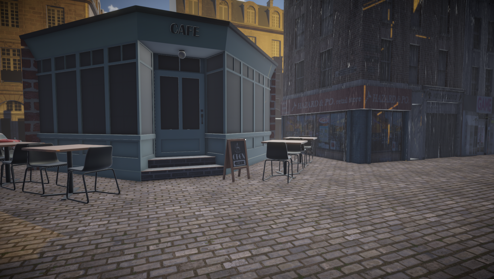
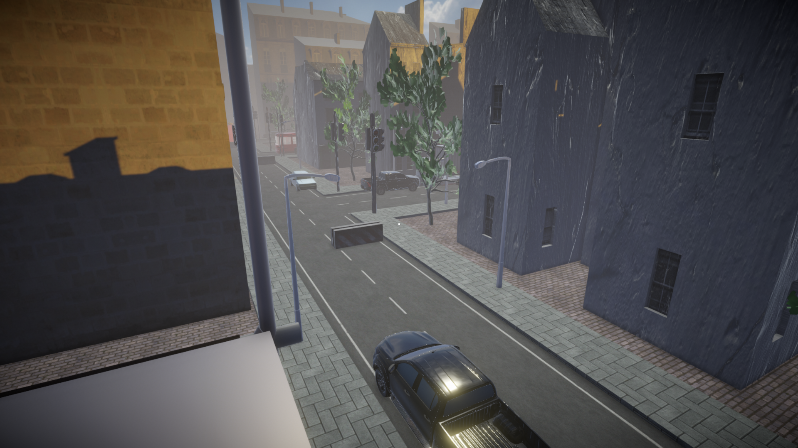

# CSGO2-Inspired Environment

## Overview
During my game development studies, I was tasked to create a map for Counter-Strike 2 (CS:GO 2) using Unity. To design my environment and create my environment, I conducted research about first-person shooter (FPS) games within the competitive scene to better understand how potential players could make use of weapons, cover and elevation. Creating this map allowed me to develop my understanding of the Unity game engine and the importance of lighting, elevation and flow.

## Features
- A 3D city environment designed an FPS game, which the player can explore
- Post-processing effects to create the player’s field-of-vision (FOV)
- Lighting, sound effects and a skybox to enhance immersion and realism

## Tools
- **Blender**: Utilised Image as Planes to implement the storefronts
- **Unity**: Built the environment using ProBuilder, prefabs, colliders, post-processing effects, lighting and a skybox

## Media 

### Screenshots

*Overview of the city.*

*Close-up of the Café and nearby structures.*

*Example of elevation, cover and sightlines within the map.*

*Close-up of different storefronts.*

[Watch the Demo](https://github.com/Programmer25X/CSGO2-Environment/releases/tag/Video)

[Download on itch.io](https://programmer025x.itch.io/csgo2-coursework-environment)

## Reflection 
Working on this project gave me valuable practical insight into how crucial gameplay mechanics, player audience, elevation, flow and atmosphere are when designing and creating a level. Furthermore, when designing and creating the environment I built more confidence in using Unity and Blender. Additionally, I was also able to reinforce my understanding of how important planning, testing and iteration are when designing a product. I have since used these skills to work on other projects, some of which are more complex, such as [The Departed](https://github.com/Programmer25X/The-Departed). 

## Used Assets & Credits

**Disclaimer**: The 3D environment was developed for **educational and portfolio purposes only**. To my knowledge, the assets used and their creators have been listed, with credit being given to the creators for their work. I **do not** claim any ownership of the assets used. If there are any issues or amendments that need to be made, please contact me.

###  3D Models and Environments
- [**Garbage Bin**](https://sketchfab.com/3d-models/garbage-bin-fba6b5a8afdd4eb0a43be29aabceb3d6) — By **Rob Ortiz**, licensed under [**CC BY 4.0**](https://creativecommons.org/licenses/by/4.0/)
- [**Basic Street Lamp**](https://sketchfab.com/3d-models/basic-street-lamp-76ac24320c6a419e9a71bc5d7f54fc68) — By **elouisetrewartha**, licensed under [**CC BY-NC 4.0**](https://creativecommons.org/licenses/by-nc/4.0/)
- [**Nivelles House 10b Belgium**](https://sketchfab.com/3d-models/nivelles-house-10b-belgium-e837c48da1a24890a2b43123857e1fe6) — By **Lost Gecko**, licensed under [**CC BY 4.0**](https://creativecommons.org/licenses/by/4.0/)
- [**Tree For Games**](https://sketchfab.com/3d-models/tree-for-games-f91d3c3c527d47fdb217c291e4c7df4b) — By **Daniel Gryningstjerna**, licensed under [**CC BY 4.0**](https://creativecommons.org/licenses/by/4.0/)
- [**Nivelles Shop 1 Belgium**](https://sketchfab.com/3d-models/nivelles-shop-1-belgium-209c0097e5ab46fd8be7ca5d904479e9) — By **Lost Gecko**, licensed under [**CC BY 4.0**](https://creativecommons.org/licenses/by/4.0/)
- [**Nivelles House 2 Belgium**](https://sketchfab.com/3d-models/nivelles-house-2-belgium-65523e6f1e3c46d9930aa727a457cf0f) — By **Lost Gecko**, licensed under [**CC BY 4.0**](https://creativecommons.org/licenses/by/4.0/)
- [**British compact car - Low poly model**](https://skfb.ly/6Vs8M) — By **Daniel Zhabotinsk**, licensed under [**CC BY 4.0**](https://creativecommons.org/licenses/by/4.0/)
- [**Road System**](https://assetstore.unity.com/packages/tools/level-design/road-system-192818#description) — By **Maxi Barmetler**
- [**Corner cafe**](https://sketchfab.com/3d-models/corner-cafe-6dfed585fefe45099901b0a8d61b9879) — By **patrakeevasveta**, licensed under [**CC BY 4.0**](https://creativecommons.org/licenses/by/4.0/) *(In the scene, I added a wall at the back of the café.)​*
- [**Cork Corner Shop 1 Ireland**](https://sketchfab.com/3d-models/cork-corner-shop-1-ireland-21818eaa4c1c402a82baf9031ebaa93a) — By **Lost Gecko**, licensed under [**CC BY 4.0**](https://creativecommons.org/licenses/by/4.0/)
- [**Bordeaux Flat 2 corner France**](https://sketchfab.com/3d-models/bordeaux-flat-2-corner-france-d390f8d7c3064060b03a753ec02c1da1) — By **Lost Gecko**, licensed under [**CC BY 4.0**](https://creativecommons.org/licenses/by/4.0/)
- [**Conwy Pharmacy UK**](https://sketchfab.com/3d-models/conwy-pharmacy-uk-303095c86b1741a595cb86a7ae027bea) — By **Lost Gecko**, licensed under [**CC BY 4.0**](https://creativecommons.org/licenses/by/4.0/)
- [**Traffic Light**](https://sketchfab.com/3d-models/traffic-light-321e93bc36af4531b350febcfefee621) — By **Lyskilde**, licensed under [**CC BY-NC 4.0**](https://creativecommons.org/licenses/by-nc/4.0/)
- [**Toyota Corola**](https://sketchfab.com/3d-models/toyota-corola-aab1b90a73f7416890c31a8927cc5038) — By **danieljorge435**, licensed under [**CC BY 4.0**](https://creativecommons.org/licenses/by/4.0/)
- [**2022 Toyota Hilux**](https://sketchfab.com/3d-models/2022-toyota-hilux-82bd37c5065040098fb0b86e07fcb959) — By **BHP3D**, licensed under [**CC BY 4.0**](https://creativecommons.org/licenses/by/4.0/)
- [**Generic Town Bus**](https://sketchfab.com/3d-models/generic-town-bus-14fe03d792914d51b6c6250b393c44fd) — By **own.guest**, licensed under [**CC BY 4.0**](https://creativecommons.org/licenses/by/4.0/)
- [**Dumpster**](https://sketchfab.com/3d-models/dumpster-3e37f225ff474567a68c998b47fcde26) — By **wand3rer**, licensed under [**CC BY 4.0**](https://creativecommons.org/licenses/by/4.0/)
- [**Construction Signs Set**](https://sketchfab.com/3d-models/construction-signs-set-96b3785bb7654f4f8812d23bfaa9830d) — By **Caboose3d**, licensed under [**CC BY 4.0**](https://creativecommons.org/licenses/by/4.0/)
- [**Fountain Prop**](https://assetstore.unity.com/packages/3d/fountain-prop-75912) — By **Thunderent**
- [**Old Bench**](https://skfb.ly/6WzQ) — By **Thunder**, licensed under [**CC BY-SA 4.0**](https://creativecommons.org/licenses/by-sa/4.0/)
- [**Low Poly Truck**](https://sketchfab.com/3d-models/low-poly-truck-d61a2ac0a706462ebf82459907f21573) — By **FS 3D Studio**, licensed under [**CC BY 4.0**](https://creativecommons.org/licenses/by/4.0/)
- [**Concrete Block**](https://sketchfab.com/3d-models/concrete-block-11a24dbe3be24f299519387f5fffd62e) — By **ThomasE**, licensed under [**CC BY 4.0**](https://creativecommons.org/licenses/by/4.0/)
- [**Procedural City Generator**](https://probabletrain.itch.io/city-generator) — By **ProbableTrain** *(I used this to create the surrounding buildings outside of the city.)*

### Textures & HDRIs
- [**Concrete Pavement 02**](https://polyhaven.com/a/concrete_pavement_02) — By **Charlotte Baglioni**, licensed under [**CC0**](https://polyhaven.com/license)
- [**Skybox Series Free**](https://assetstore.unity.com/packages/2d/textures-materials/sky/skybox-series-free-103633) — By **Avionx**
- [**Kloofendal 48d Partly Cloudy (Pure Sky)**](https://polyhaven.com/a/kloofendal_48d_partly_cloudy_puresky) — By **Greg Zaal** & **Jarod Guest**, licensed under [**CC0**](https://polyhaven.com/license)
- [**Cracked Concrete Wall**](https://polyhaven.com/a/cracked_concrete_wall) — By **Dimitrios Savva** & **Rico Cilliers**, licensed under [**CC0**](https://polyhaven.com/license)
- [**Rusty Metal 02**](https://polyhaven.com/a/rusty_metal_02) — By **Rob Tuytel**, licensed under [**CC0**](https://polyhaven.com/license)
- [**Rust Coarse 01**](https://polyhaven.com/a/rust_coarse_01) — By **Dimitrios Savva** & **Rico Cilliers**, licensed under [**CC0**](https://polyhaven.com/license)
- [**Weathered Brown Planks**](https://polyhaven.com/a/weathered_brown_planks) — By **Dimitrios Savva** & **Rico Cilliers**, licensed under [**CC0**](https://polyhaven.com/license)
- [**Buildings - Batch of 21 Seamless Textures with normalmaps**](https://opengameart.org/content/buildings-batch-of-21-seamless-textures-with-normalmaps) — By **Keith333**, licensed under [**CC BY 3.0**](https://creativecommons.org/licenses/by/3.0/)

### Sounds
- [**Air Tone - School Yard - Dawn Empty City Air**](https://freesound.org/people/leonelmail/sounds/427840/?) — By **leonelmail**, licensed under [**CC0 1.0**](https://creativecommons.org/publicdomain/zero/1.0/)
- [**moving plant**](https://freesound.org/people/Eelke/sounds/185368/?) — By **Eelke**, licensed under [**CC0 1.0**](https://creativecommons.org/publicdomain/zero/1.0/)
- [**Rusle of leaves 2**](https://freesound.org/people/Magnesus/sounds/729440/) — By **Magnesus**, licensed under [**CC0 1.0**](https://creativecommons.org/publicdomain/zero/1.0/)
- [**bushmovement**](https://pixabay.com/sound-effects/bushmovement-6986/) — By **j1987 (Freesound)**, licensed under [**Pixabay Content License**](https://pixabay.com/service/license-summary/)

### Images
- [**Sweet Shop Front**](https://i0.wp.com/www.ellieandco.co.uk/wp-content/uploads/2018/11/brighton-lost-shopfronts-1-2.jpg?fit=900%2C634&ssl=1)
- [**GAME store closed.jpg**](https://commons.wikimedia.org/wiki/File:GAME_store_closed.jpg) — By **Smurfy**, licensed under [**CC0 1.0**](https://creativecommons.org/publicdomain/zero/1.0/deed.en)
- [**Old fashioned shop front in Main Street - geograph.org.uk - 1156700.jpg**](https://commons.wikimedia.org/wiki/File:Old_fashioned_shop_front_in_Main_Street_-_geograph.org.uk_-_1156700.jpg) — By **ceridwen**, licensed under [**CC BY-SA 2.0**](https://creativecommons.org/licenses/by-sa/2.0/deed.en)
- [**Starbucks-Coffee-Osu.jpg**](https://commons.wikimedia.org/wiki/File:Starbucks-Coffee-Osu.jpg) — By **HQA02330**, licensed under [**CC BY-SA 4.0**](https://creativecommons.org/licenses/by-sa/4.0/deed.en)
- [**Wild Things Shop Front**](https://www.pexels.com/photo/exterior-of-local-shop-in-city-in-daytime-6016926/) — By **Erik Mclean**, licensed under [**Pexels License**](https://www.pexels.com/license/)

